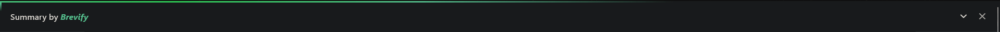
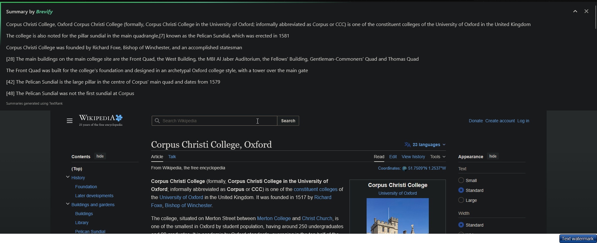
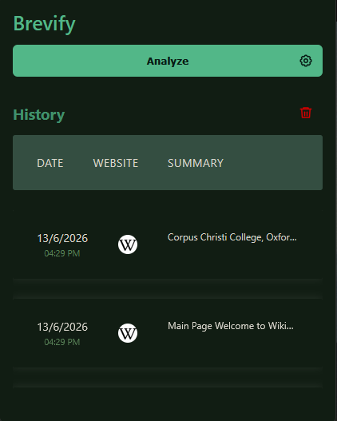
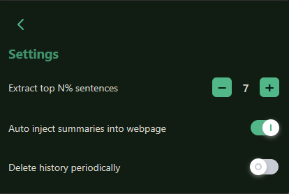

# Brevify

  <em>A cross-browser extension for Chrome and Firefox to highlight contents that matters</em>

---

#### A lightweight browser extension that delivers instant extractive summaries right where you need them.

## ✨ Features

- 📝 **Extractive Summaries** - Get accurate, context-preserving summaries of webpage content using advanced TextRank algorithm
- ⚡ **Lightning Fast** - No bloated libraries! Everything is written from scratch for optimal performance
- 🎨 **Clean UI** - Beautiful, minimalist interface that seamlessly integrates with any webpage
- 📚 **History Support** - Store and re-access your summaries easily for future reference
- 🔝 **Direct Injection** - Summaries appear right at the top of the webpage with an elegant animated border
- 🌓 **UI Adaptation** - Automatically adapts to your website's color scheme
- 🚫 **Privacy First** - All processing happens locally, no data sent to external servers

---

## 📸 Screenshots

### Banner Integration

_The summary banner seamlessly integrates at the top of any webpage_

### Expanded Summary

_Click to expand and view the complete extractive summary_

### Extension Popup

_Clean, intuitive popup interface for quick access_

### Tweaks Menu

_Customize your summarization preferences with fine-grained controls_

---
